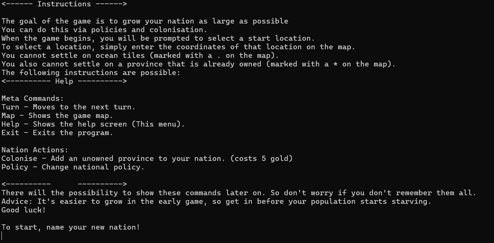
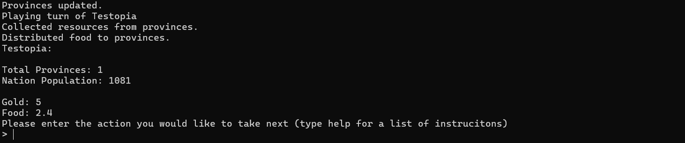
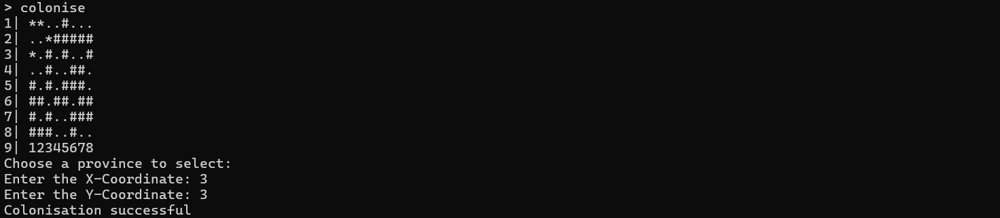
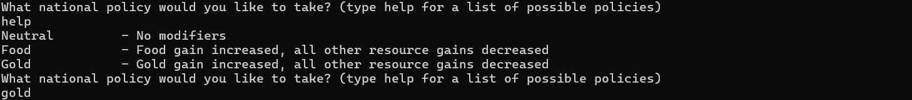

# Overview
The nation building simulator is a simple simulation of building a nation. The goal is grow your nation to the largest populaton possible without running out of food or gold. Interatcion with the world is completed via a set of commands. When in game, use help to get a list of all possible commands

# Features
* Map creation
* Ability to create nations and own provinces
* Ability to expand your nation via colonisation
* National policy, which affects resource gains
* Displaying game map, showing which provinces are colonised

# Installation Instructions
* To install the program, head to https://github.com/Thesupernile/NationBuildingSim/releases/tag/V1.0.0
* Once there, download the file named NationSim.exe
* Navigate to your downloads folder and execute the file to run the simulator
* Enjoy :)

# Screenshots

Instruction Screen:

Main info screen:

Map during colonisation screen:

Policy Selection, including help screen:

